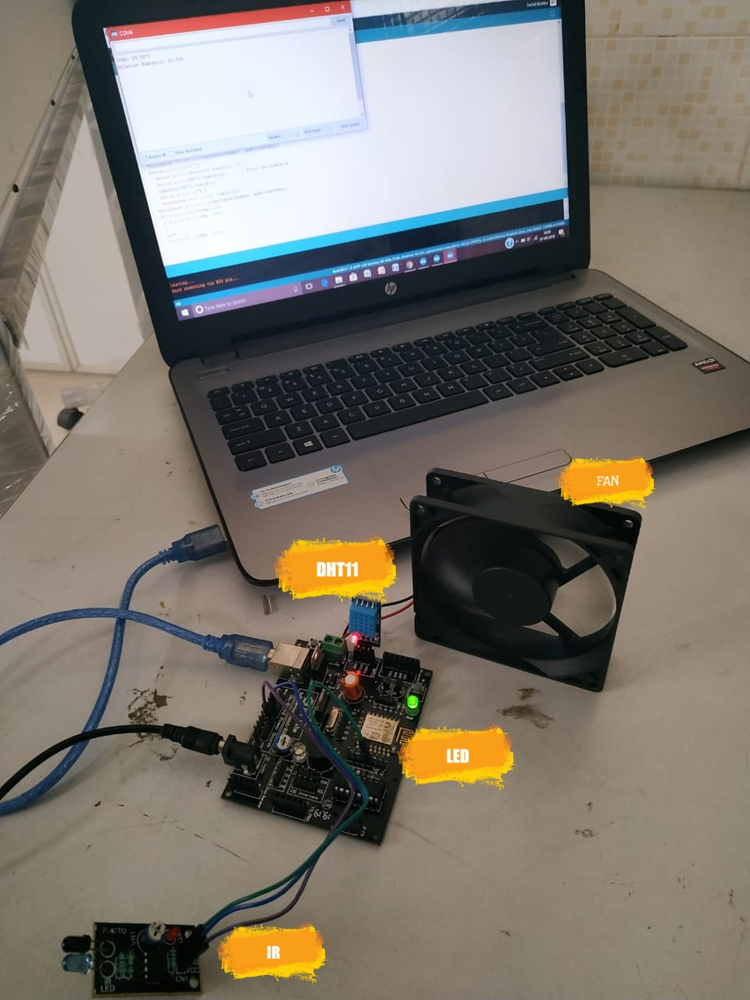

# SmartHomeSystem
A system that uses IoT, Arduino technologies to toggle the lights and fans by detecting the temperature and sensing the movements in a room. 
<b>Working:</b> 
The Infrared sensor detects the movement of something, and then turns the LED on, and if the temperature is more than 30 degrees celcius(which is detected by DHT11 sensor), the fan is turned on.   

</img>

